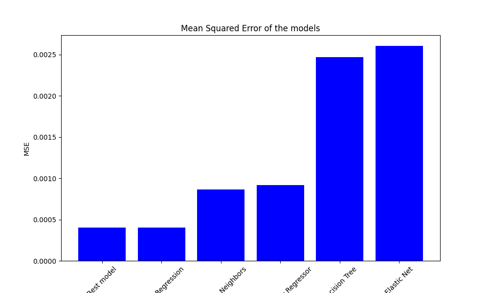
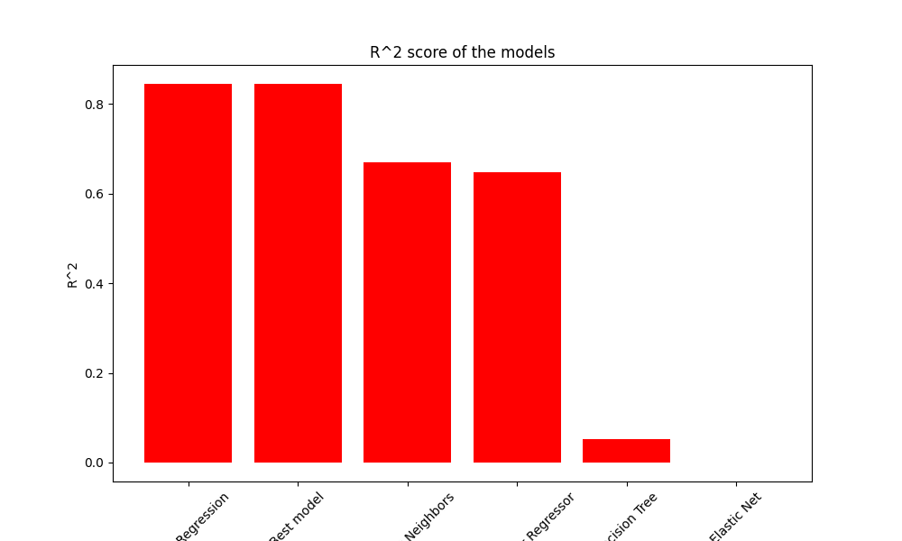

# Flood prediction

This project aims to predict flood probability based on various features. The dataset used is from
the [Regression with a Flood Prediction Dataset](https://www.kaggle.com/competitions/playground-series-s4e5). 
The project was done in Python and R.

## Installation

For the Python part, you need to run the following command:

```bash
poetry install
```

## Data

The comprehensive data description can be found in Python notebook. Some of the features are:
 - MonsoonIntensity: Index representing monsoon intensity. Higher values indicate greater monsoon rainfall intensity. (strong temporary wind)
 - RiverManagement: Index representing the effectiveness of river management. Higher values indicate more effective management.
 - IneffectiveDisasterPreparedness: Index representing the ineffectiveness of disaster preparedness. Higher values indicate less effective preparedness.
 - PopulationScore: Index representing population density. Higher values indicate greater population density.

Target variable
 - FloodProbability: Flood probability, expressed as a continuous value between 0 and 1, where higher values indicate greater flood probability.

## Models comparison

The following plots were created to compare the performance of different models:

 - Numerical features


- MSE of all models



- R^2 of all models

