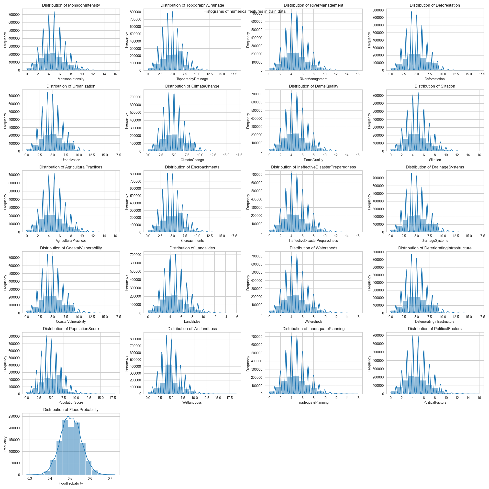

```{r}
library(dplyr)
library(rpart)
library(caret)
```

# 1. Load data

```{r}
# load data
df <- read.csv("../data/train.csv")
head(df)
```

```{r}
# drop first column which is the id
df <- df %>% select(-id)
head(df)
```

# 2. Data exploration

Data exploration was performed in Python and the results can be checked in the notebook. Here are some of the generated plots during the exploration.



# 3. Feature scaling

```{r}
# scale all columns except the target column
cols_to_scale <- colnames(df)[1:(ncol(df)-1)]
df[cols_to_scale] <- scale(df[cols_to_scale])
head(df)
```

# 4. Model selection

## 4.1 Train/Test split

```{r}
# select indices for train set
set.seed(123)
train_index <- sample(1:nrow(df), 0.8 * nrow(df))

# split data into train set
X_train <- df[train_index,]
y_train <- df$FloodProbability[train_index]

# split data into test set
X_test <- df[-train_index,]
y_test <- df$FloodProbability[-train_index]
```

```{r}
# 10-fold cross validation
ctrl <- trainControl(method = "cv", number = 10)
```

## 4.2 Regression

### 4.2.1 Linear Regression

```{r}
model_lm <- train(FloodProbability ~ ., data = X_train, method = "lm", trControl = ctrl)
summary(model_lm)
```

```{r}
# check model performance on test set anc calculate RMSE
y_pred <- predict(model_lm, X_test)
lm_rmse <- sqrt(mean((y_test - y_pred)^2))
lm_rmse
```

**Conclusion**

The linear regression model has an R-squared value of **0.8449**, which means that approximately **84.49%** of the variance in the dependent variable can be explained by the independent variables. The adjusted R-squared value, which takes into account the number of predictors in the model, is also 0.8449. This suggests that the model is not overly complex and is making good use of the predictors to explain the variance in the dependent variable.

All the predictors are statistically significant as their p-values are less than 0.05. This indicates that all these variables have a significant contribution to the model.

The Residual Standard Error (RSE) is 0.02009, which is a measure of the typical difference between the actual and predicted values of the dependent variable. This value is relatively small, suggesting that the model's predictions are reasonably close to the actual values.

The Root Mean Square Error (RMSE) of the model on the test set is 0.02011235. The RMSE is a measure of the differences between values predicted by the model and the values actually observed. The smaller the RMSE, the better the model's performance. In this case, the RMSE is quite small, indicating that the model has a good fit to the data.

The model accuracy is 

### 4.2.2 Decision Tree Regression

```{r}
model_tree <- rpart(FloodProbability ~ ., data = X_train)
summary(model_tree)
```

```{r}
# check model performance on test set and calculate RMSE
y_pred <- predict(model_tree, X_test)
tree_rmse <- sqrt(mean((y_test - y_pred)^2))
tree_rmse
```

**Conclusion**
The model has a complexity parameter of 0.0249, which is a measure of the model's complexity. A lower complexity parameter indicates a simpler model, which can help prevent overfitting.

The model's performance was evaluated using the Root Mean Square Error (RMSE), a common metric for regression models that measures the average magnitude of the model's prediction errors. The RMSE of the model on the test set is 0.04985499. The smaller the RMSE, the better the model's performance. In this case, the RMSE is quite small, indicating that the model has a good fit to the data. 


## 4.3 Train/Test for Classification problem

```{r}
# create isFlood column where 0 is no flood and 1 is flood
df$isFlood <- ifelse(df$FloodProbability > 0.5, 1, 0)
df <- df %>% select(-FloodProbability)
df$isFlood <- as.factor(df$isFlood)
head(df)
```

```{r}
# select indices for train set
train_index <- sample(1:nrow(df), 0.8 * nrow(df))

# split data into train set
X_train <- df[train_index,]
y_train <- df$isFlood[train_index]

# split data into test set
X_test <- df[-train_index,]
y_test <- df$isFlood[-train_index]
```

## 4.4 Classification problem

### 4.4.1 Logistic Regression

```{r}
# train logistic regression model with cross validation
model_logit <- train(isFlood ~ ., data = X_train, method = "glm", trControl = ctrl, family = "binomial")
summary(model_logit)
```

```{r}
# check model performance on test set and calculate accuracy
y_pred <- predict(model_logit, X_test, type = "raw")
logit_accuracy <- sum(y_pred == y_test) / length(y_test)
logit_accuracy
```

**Conclusion**

The model uses a variety of predictors, all of which are statistically significant in predicting the target variable isFlood as their p-values are less than **0.05**. This indicates that all these variables have a significant contribution to the model.

The coefficients of the predictors range from 0.417648 (MonsoonIntensity) to 0.430586 (CoastalVulnerability). These coefficients represent the change in the log-odds of the outcome for a one-unit increase in the predictor variable, holding all other predictors constant. For example, for every one-unit increase in MonsoonIntensity, the log-odds of a flood occurring (as predicted by the model) increase by 0.417648, assuming all other variables are held constant.

The model's intercept is -41.821899, which is the log-odds of a flood occurring when all predictor variables are zero.
The model's null deviance is 1239519, which is the deviance of a model with no predictors, and the residual deviance is 608852, which is the deviance of the model with predictors. The smaller the residual deviance compared to the null deviance, the better the model is at explaining the variance in the target variable.

The model's performance was evaluated using the accuracy metric on the test set, which is 0.887822. This means that the model correctly predicted whether a flood will occur or not about 88.78% of the time.

### 4.4.2 Tree Classification

```{r}
# train tree model with cross validation
model_tree_cl <- rpart(isFlood ~ ., data = X_train)
summary(model_tree_cl)
```

```{r}
# check model performance on test set and calculate accuracy
y_pred <- predict(model_tree_cl, X_test, type = "class")
tree_accuracy <- sum(y_pred == y_test) / length(y_test)
tree_accuracy
```

**Conclusion**

The complexity parameter (CP) of the model is 0.10222077 at the first split, which is a measure of the model's complexity. A lower complexity parameter indicates a simpler model, which can help prevent overfitting. The model's performance was evaluated using the accuracy metric on the test set, which is 0.5875. This means that the model correctly predicted whether a flood will occur or not about 58.75% of the time.

The model's tree structure shows that it made several splits based on the predictors. For instance, the first split was made on DamsQuality with a value less than 4.5 going to the left. This split improved the model's performance by 6239.903. Other important splits were made on TopographyDrainage, RiverManagement, Landslides, and ClimateChange.

Model accuracy is worse than Logisit Regression model.